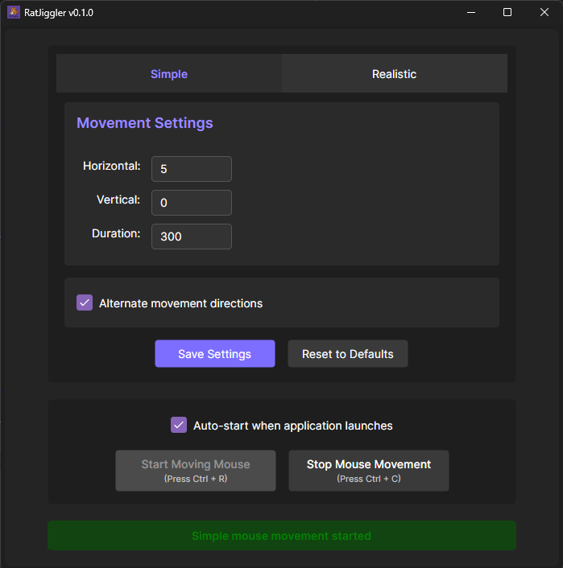
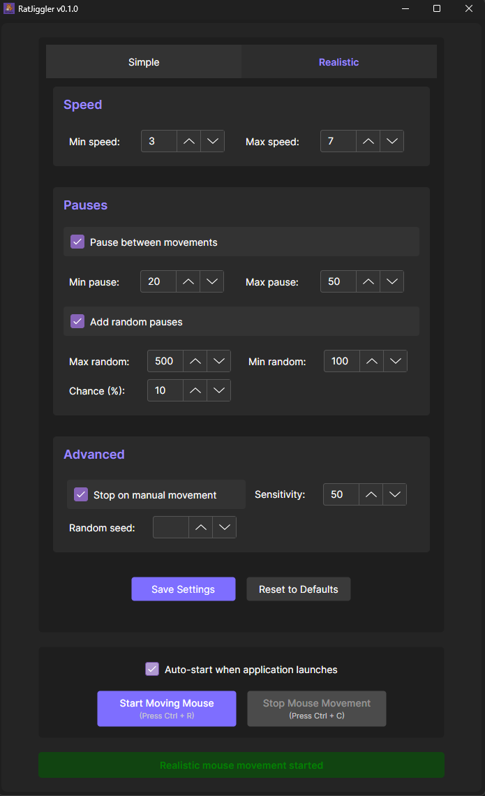

# RatJiggler
 

Simulate mouse movement for Windows and Linux.

Very useful to avoid being kicked out for being idle in some applications(like games, MMOs, game streaming, etc.)
or keep your pc awake without having to change the power settings.

## Features

- Simple mouse movement: Move the mouse between two points;
- Realistic mouse movement: Move the mouse in a realistic way, trying to mimic real mouse movement;
- Configurable settings;
- Hotkeys for starting and stopping movement.

## How to use

1. Download the latest release from the [releases page](https://github.com/adleywd/RatJiggler/releases).
2. Run the program.
3. Configure the settings as desired.
4. Press the "Start Moving Mouse" button to start the movement.

## Tips

- You can hover the labels for more information about the settings.
- You can move the mouse very slightly, like 1 pixel in X axis or Y axis, and most applications it will understand as if mouse is moving, but you will not notice it.
- You can use the hotkeys Ctrl + R and Ctrl + C to start and stop the movement, but the application must be in focus for them to work.
- The application save the settings in windows at `%LocalAppData%\RatJiggler\`.
- The application save the settings in linux at `~/.local/share/RatJiggler/`.

## Screenshots

